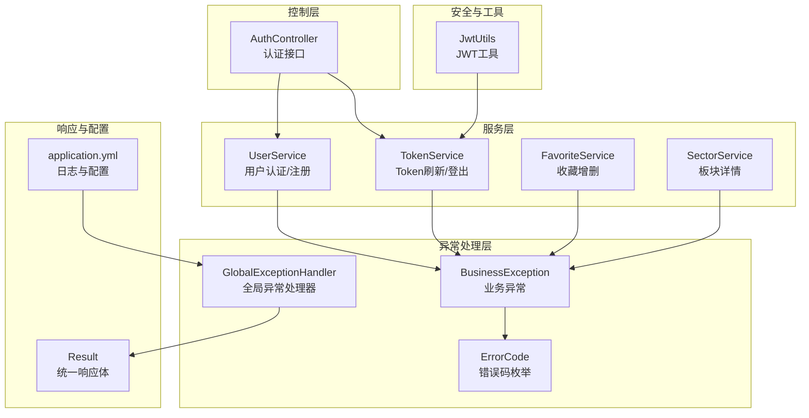
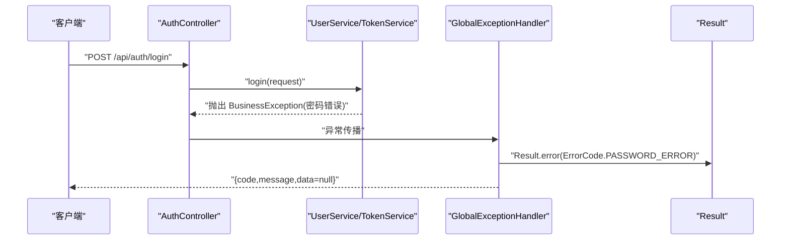
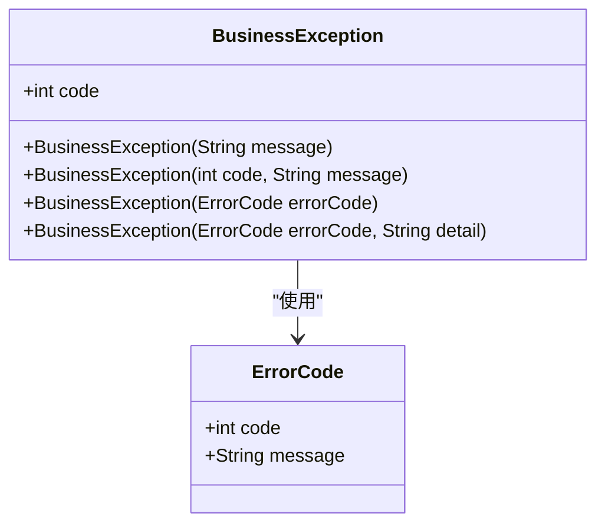
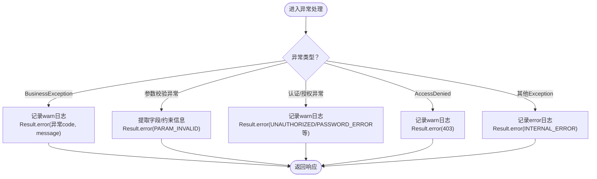
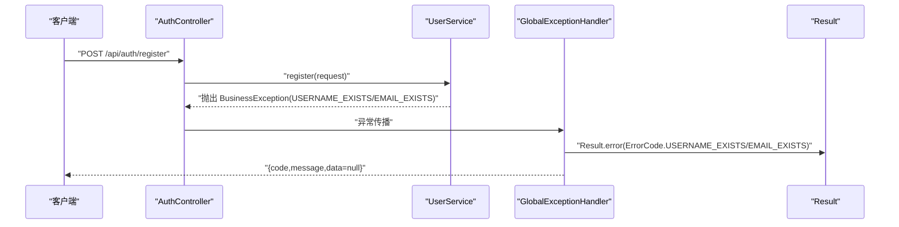
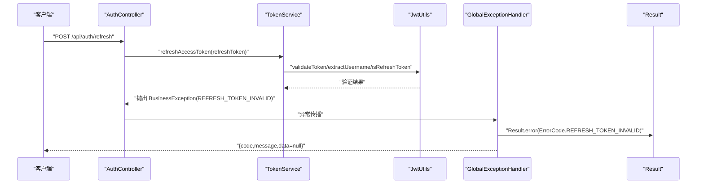
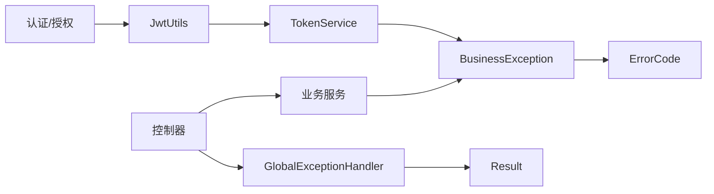

# 异常处理与错误管理

<cite>
**本文引用的文件**
- [BusinessException.java](file://backend/src/main/java/com/freetrader/exception/BusinessException.java)
- [ErrorCode.java](file://backend/src/main/java/com/freetrader/exception/ErrorCode.java)
- [GlobalExceptionHandler.java](file://backend/src/main/java/com/freetrader/exception/GlobalExceptionHandler.java)
- [Result.java](file://backend/src/main/java/com/freetrader/dto/Result.java)
- [UserService.java](file://backend/src/main/java/com/freetrader/service/UserService.java)
- [TokenService.java](file://backend/src/main/java/com/freetrader/service/TokenService.java)
- [FavoriteService.java](file://backend/src/main/java/com/freetrader/service/FavoriteService.java)
- [SectorService.java](file://backend/src/main/java/com/freetrader/service/SectorService.java)
- [AuthController.java](file://backend/src/main/java/com/freetrader/controller/AuthController.java)
- [JwtUtils.java](file://backend/src/main/java/com/freetrader/security/JwtUtils.java)
- [application.yml](file://backend/src/main/resources/application.yml)
</cite>

## 目录
1. [简介](#简介)
2. [项目结构](#项目结构)
3. [核心组件](#核心组件)
4. [架构总览](#架构总览)
5. [组件详解](#组件详解)
6. [依赖关系分析](#依赖关系分析)
7. [性能考量](#性能考量)
8. [故障排查指南](#故障排查指南)
9. [结论](#结论)
10. [附录](#附录)

## 简介
本文件面向 FreeTrader 的异常处理与错误管理，系统性阐述异常体系设计与实现，包括业务异常 BusinessException 的定义与使用场景、错误码 ErrorCode 的设计与分类、全局异常处理器 GlobalExceptionHandler 的统一处理策略，以及最佳实践与调试技巧。目标是帮助开发者在保持一致的错误语义与响应格式的同时，提升系统的可维护性与可观测性。

## 项目结构
异常处理相关代码主要分布在以下包与文件中：
- exception：业务异常、错误码、全局异常处理器
- dto：统一响应体 Result
- service：各业务层抛出 BusinessException 的具体实现
- controller：对外暴露的 API 接口
- security：JWT 工具类，参与认证/授权相关的异常判定
- resources：应用配置，包含日志级别等与异常可观测性相关的设置

图表来源
- [BusinessException.java](file://backend/src/main/java/com/freetrader/exception/BusinessException.java#L1-L30)
- [ErrorCode.java](file://backend/src/main/java/com/freetrader/exception/ErrorCode.java#L1-L35)
- [GlobalExceptionHandler.java](file://backend/src/main/java/com/freetrader/exception/GlobalExceptionHandler.java#L1-L87)
- [Result.java](file://backend/src/main/java/com/freetrader/dto/Result.java#L1-L31)
- [UserService.java](file://backend/src/main/java/com/freetrader/service/UserService.java#L1-L103)
- [TokenService.java](file://backend/src/main/java/com/freetrader/service/TokenService.java#L1-L64)
- [FavoriteService.java](file://backend/src/main/java/com/freetrader/service/FavoriteService.java#L1-L119)
- [SectorService.java](file://backend/src/main/java/com/freetrader/service/SectorService.java#L1-L253)
- [AuthController.java](file://backend/src/main/java/com/freetrader/controller/AuthController.java#L1-L72)
- [JwtUtils.java](file://backend/src/main/java/com/freetrader/security/JwtUtils.java#L1-L194)
- [application.yml](file://backend/src/main/resources/application.yml#L1-L102)

章节来源
- [BusinessException.java](file://backend/src/main/java/com/freetrader/exception/BusinessException.java#L1-L30)
- [ErrorCode.java](file://backend/src/main/java/com/freetrader/exception/ErrorCode.java#L1-L35)
- [GlobalExceptionHandler.java](file://backend/src/main/java/com/freetrader/exception/GlobalExceptionHandler.java#L1-L87)
- [Result.java](file://backend/src/main/java/com/freetrader/dto/Result.java#L1-L31)
- [application.yml](file://backend/src/main/resources/application.yml#L77-L91)

## 核心组件
- 业务异常 BusinessException：封装业务错误码与消息，继承自运行时异常，便于在业务流程中快速中断并向上抛出。
- 错误码 ErrorCode：集中定义各类错误码及其本地化消息，按领域分段（通用、认证、用户、业务），便于统一管理和扩展。
- 全局异常处理器 GlobalExceptionHandler：基于 Spring MVC 的@RestControllerAdvice，对不同异常类型进行统一捕获与响应包装。
- 统一响应体 Result：标准化接口返回结构，包含 code、message、data，简化前端消费与错误展示。

章节来源
- [BusinessException.java](file://backend/src/main/java/com/freetrader/exception/BusinessException.java#L6-L29)
- [ErrorCode.java](file://backend/src/main/java/com/freetrader/exception/ErrorCode.java#L8-L34)
- [GlobalExceptionHandler.java](file://backend/src/main/java/com/freetrader/exception/GlobalExceptionHandler.java#L16-L86)
- [Result.java](file://backend/src/main/java/com/freetrader/dto/Result.java#L10-L29)

## 架构总览
异常处理在系统中的流转路径如下：
- 业务层在检测到异常条件时抛出 BusinessException 或基于 ErrorCode 抛出带错误码的异常。
- 控制器层接收请求，调用服务层；若服务层抛出异常，由全局异常处理器统一拦截。
- 全局异常处理器根据异常类型选择对应处理逻辑，并通过 Result 封装统一响应体返回给客户端。
- 对于参数校验、认证/授权失败等 Spring/Web 层异常，也由处理器统一转换为标准错误响应。

图表来源
- [AuthController.java](file://backend/src/main/java/com/freetrader/controller/AuthController.java#L36-L38)
- [UserService.java](file://backend/src/main/java/com/freetrader/service/UserService.java#L79-L81)
- [GlobalExceptionHandler.java](file://backend/src/main/java/com/freetrader/exception/GlobalExceptionHandler.java#L20-L24)
- [Result.java](file://backend/src/main/java/com/freetrader/dto/Result.java#L23-L29)

## 组件详解

### 业务异常 BusinessException
- 设计要点
  - 支持多种构造方式：纯消息、显式错误码+消息、ErrorCode 枚举、带细节的 ErrorCode。
  - 通过 getter 暴露 code 字段，便于全局处理器读取并写入响应。
- 使用场景
  - 用户名/邮箱重复、密码错误、Token 无效/过期、板块不存在、收藏已存在/未收藏等。
- 性能与复杂度
  - O(1) 异常创建与传播；无额外 IO 开销。
- 注意事项
  - 优先使用 ErrorCode 构造，确保错误码与消息的一致性与可维护性。

图表来源
- [BusinessException.java](file://backend/src/main/java/com/freetrader/exception/BusinessException.java#L6-L29)
- [ErrorCode.java](file://backend/src/main/java/com/freetrader/exception/ErrorCode.java#L8-L34)

章节来源
- [BusinessException.java](file://backend/src/main/java/com/freetrader/exception/BusinessException.java#L6-L29)

### 错误码 ErrorCode
- 设计原则
  - 分类清晰：通用(1xxx)、认证(2xxx)、用户(3xxx)、业务(4xxx)。
  - 国际化预留：当前以中文消息为主，便于扩展为多语言资源文件。
  - 可扩展：新增错误码遵循分段规则，避免冲突。
- 常见错误码与使用位置
  - 参数校验失败：用于参数校验异常统一映射。
  - 未授权/Token无效/过期/刷新Token无效：用于认证/授权相关异常。
  - 用户不存在/用户名已存在/邮箱已存在/密码错误：用于用户相关业务。
  - 板块不存在/已收藏/未收藏：用于收藏与板块详情相关业务。

章节来源
- [ErrorCode.java](file://backend/src/main/java/com/freetrader/exception/ErrorCode.java#L8-L34)

### 全局异常处理器 GlobalExceptionHandler
- 职责与覆盖范围
  - 捕获 BusinessException 并返回对应错误码与消息。
  - 捕获参数校验异常（方法参数、绑定、约束）并统一映射为参数校验错误码。
  - 捕获认证/授权相关异常（凭证错误、访问拒绝）并返回相应错误码。
  - 捕获通用 Exception 并返回内部错误码，保护系统内部细节。
- 响应格式
  - 使用 Result.error(code, message) 统一输出，保证前后端一致的错误契约。
- 日志记录
  - 对业务异常、参数校验失败、认证失败、访问拒绝、系统异常分别记录不同级别的日志，便于问题定位。

图表来源
- [GlobalExceptionHandler.java](file://backend/src/main/java/com/freetrader/exception/GlobalExceptionHandler.java#L20-L85)
- [Result.java](file://backend/src/main/java/com/freetrader/dto/Result.java#L23-L29)

章节来源
- [GlobalExceptionHandler.java](file://backend/src/main/java/com/freetrader/exception/GlobalExceptionHandler.java#L16-L86)
- [Result.java](file://backend/src/main/java/com/freetrader/dto/Result.java#L10-L29)

### 统一响应体 Result
- 结构
  - code：整数错误码或成功码 200。
  - message：人类可读的消息。
  - data：泛型数据体，错误时通常为 null。
- 方法
  - success(data)/success()：构造成功响应。
  - error(message)/error(code, message)：构造错误响应。
- 作用
  - 规范化接口返回，降低前端解析成本，提升一致性。

章节来源
- [Result.java](file://backend/src/main/java/com/freetrader/dto/Result.java#L10-L29)

### 业务层异常使用示例

#### 用户注册与登录（UserService）
- 注册：当用户名或邮箱已存在时，抛出带对应错误码的 BusinessException。
- 登录：当用户不存在或密码不匹配时，抛出带错误码的 BusinessException。
- 控制器：AuthController 直接返回 Result.success，异常由全局处理器接管。

图表来源
- [UserService.java](file://backend/src/main/java/com/freetrader/service/UserService.java#L45-L51)
- [UserService.java](file://backend/src/main/java/com/freetrader/service/UserService.java#L79-L81)
- [AuthController.java](file://backend/src/main/java/com/freetrader/controller/AuthController.java#L48-L50)
- [GlobalExceptionHandler.java](file://backend/src/main/java/com/freetrader/exception/GlobalExceptionHandler.java#L20-L24)

章节来源
- [UserService.java](file://backend/src/main/java/com/freetrader/service/UserService.java#L42-L96)
- [AuthController.java](file://backend/src/main/java/com/freetrader/controller/AuthController.java#L28-L51)

#### Token 刷新（TokenService + JwtUtils）
- 当刷新 Token 无效、类型不符或已被加入黑名单时，抛出 BusinessException(REFRESH_TOKEN_INVALID)。
- JwtUtils 提供 Token 验证与类型判断，为业务层提供基础能力。

图表来源
- [TokenService.java](file://backend/src/main/java/com/freetrader/service/TokenService.java#L18-L32)
- [JwtUtils.java](file://backend/src/main/java/com/freetrader/security/JwtUtils.java#L138-L178)
- [GlobalExceptionHandler.java](file://backend/src/main/java/com/freetrader/exception/GlobalExceptionHandler.java#L20-L24)

章节来源
- [TokenService.java](file://backend/src/main/java/com/freetrader/service/TokenService.java#L18-L39)
- [JwtUtils.java](file://backend/src/main/java/com/freetrader/security/JwtUtils.java#L138-L178)

#### 收藏与板块详情（FavoriteService / SectorService）
- 收藏：重复收藏抛出 FAVORITE_EXISTS，取消收藏时未找到抛出 FAVORITE_NOT_FOUND。
- 板块详情：板块不存在时抛出 SECTOR_NOT_FOUND。

章节来源
- [FavoriteService.java](file://backend/src/main/java/com/freetrader/service/FavoriteService.java#L47-L85)
- [SectorService.java](file://backend/src/main/java/com/freetrader/service/SectorService.java#L171-L178)

## 依赖关系分析
- 低耦合高内聚
  - BusinessException 与 ErrorCode 解耦，通过构造函数组合，便于扩展与替换。
  - GlobalExceptionHandler 仅依赖 Result 与异常类型，不直接依赖业务实现，职责单一。
- 关键依赖链
  - 业务层 -> BusinessException/ErrorCode -> 全局异常处理器 -> Result -> 客户端。
  - 认证/授权层依赖 JwtUtils，为业务层提供 Token 验证与类型判断。
- 潜在风险
  - 若新增错误码未同步更新 ErrorCode，可能导致全局处理器无法正确识别。
  - 参数校验异常的字段映射可能需要根据前端需求调整。

图表来源
- [BusinessException.java](file://backend/src/main/java/com/freetrader/exception/BusinessException.java#L6-L29)
- [ErrorCode.java](file://backend/src/main/java/com/freetrader/exception/ErrorCode.java#L8-L34)
- [GlobalExceptionHandler.java](file://backend/src/main/java/com/freetrader/exception/GlobalExceptionHandler.java#L16-L86)
- [Result.java](file://backend/src/main/java/com/freetrader/dto/Result.java#L10-L29)
- [JwtUtils.java](file://backend/src/main/java/com/freetrader/security/JwtUtils.java#L138-L178)
- [TokenService.java](file://backend/src/main/java/com/freetrader/service/TokenService.java#L18-L39)

章节来源
- [BusinessException.java](file://backend/src/main/java/com/freetrader/exception/BusinessException.java#L6-L29)
- [GlobalExceptionHandler.java](file://backend/src/main/java/com/freetrader/exception/GlobalExceptionHandler.java#L16-L86)
- [JwtUtils.java](file://backend/src/main/java/com/freetrader/security/JwtUtils.java#L138-L178)

## 性能考量
- 异常路径的开销
  - 异常栈捕获与日志记录会带来一定 CPU 与 I/O 开销，应在高频异常场景下关注日志级别与采样策略。
- 响应封装
  - Result 的序列化开销极低，建议保持统一结构，避免频繁变更响应格式。
- 缓存与降级
  - 对于认证/授权失败的热点场景，可在网关或服务层增加限流与熔断，减少异常风暴。

## 故障排查指南
- 常见问题定位步骤
  - 查看日志级别：确认 application.yml 中 logging.level.* 配置，确保异常日志可见。
  - 区分异常类型：根据响应 code 判断是业务异常、参数校验异常还是系统异常。
  - 参数校验失败：查看字段名与默认消息，必要时在全局处理器中增强字段映射。
  - 认证/授权失败：核对 Token 类型、有效期与黑名单状态。
- 调试技巧
  - 在开发环境适当提高日志级别，观察 warn/error 级别日志。
  - 对关键业务点（如登录、注册、Token 刷新）增加单元测试，覆盖异常分支。
  - 使用 Swagger/OpenAPI 文档验证接口行为与错误响应。

章节来源
- [application.yml](file://backend/src/main/resources/application.yml#L77-L91)
- [GlobalExceptionHandler.java](file://backend/src/main/java/com/freetrader/exception/GlobalExceptionHandler.java#L26-L85)

## 结论
FreeTrader 的异常处理体系通过 BusinessException + ErrorCode + GlobalExceptionHandler + Result 形成闭环，实现了错误码的集中管理、异常的统一处理与响应的标准化输出。配合 JwtUtils 的认证/授权能力与服务层的业务异常抛出，整体具备良好的可维护性与可观测性。建议在后续迭代中进一步完善国际化支持与参数校验的前端友好提示。

## 附录

### 错误码一览（按领域分组）
- 通用错误 (1xxx)
  - 内部错误：1000
  - 参数校验失败：1001
- 认证错误 (2xxx)
  - 未授权访问：2001
  - Token无效：2002
  - Token已过期：2003
  - 刷新Token无效：2004
  - 用户未登录：2005
- 用户错误 (3xxx)
  - 用户不存在：3001
  - 用户名已存在：3002
  - 邮箱已被注册：3003
  - 密码错误：3004
- 业务错误 (4xxx)
  - 板块不存在：4001
  - 已收藏该板块：4002
  - 未收藏该板块：4003

章节来源
- [ErrorCode.java](file://backend/src/main/java/com/freetrader/exception/ErrorCode.java#L8-L34)