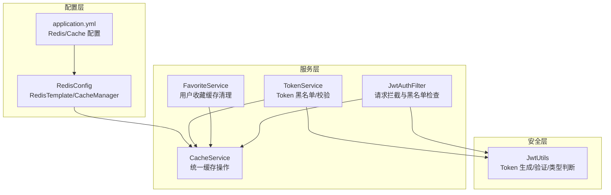
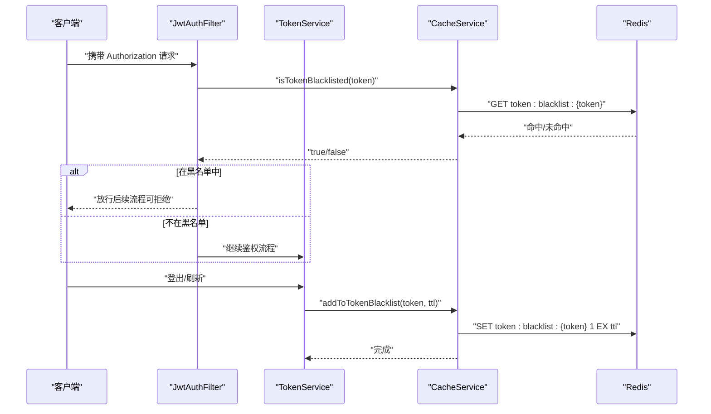
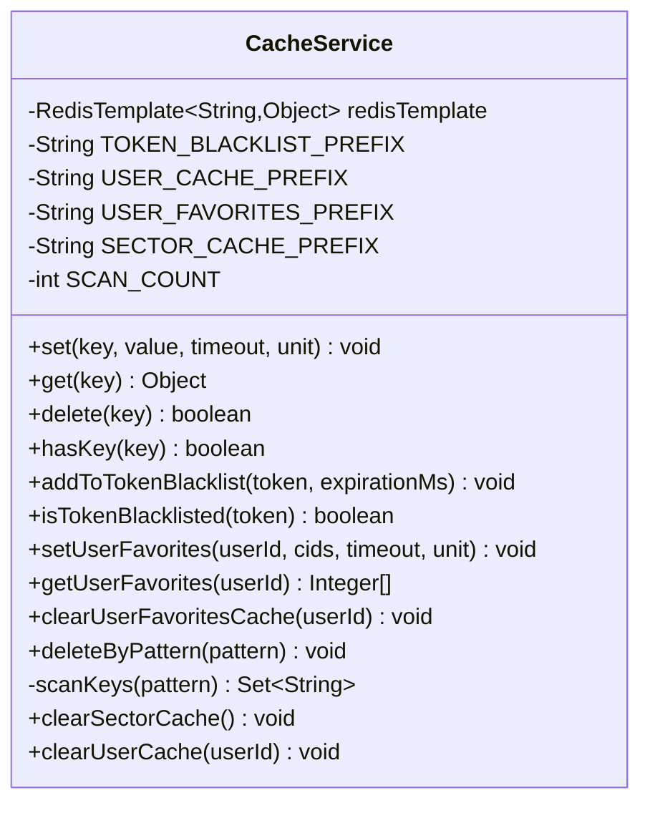
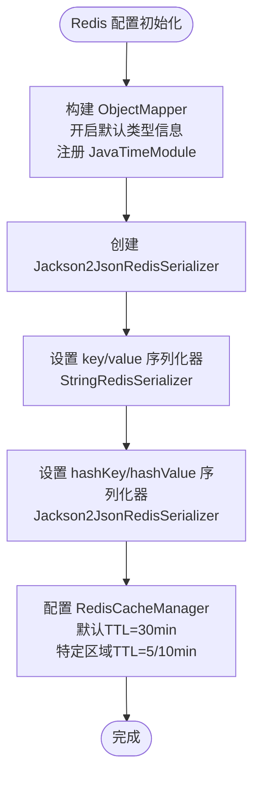
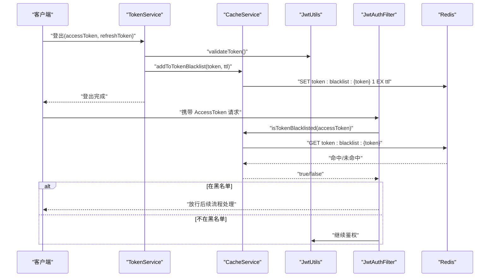
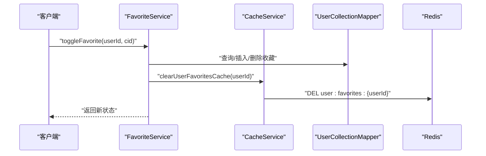
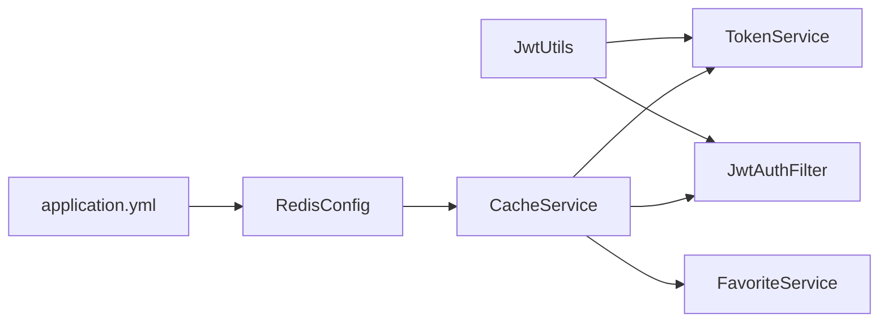

# 缓存服务

<cite>
**本文引用的文件**
- [CacheService.java](file://backend/src/main/java/com/freetrader/service/CacheService.java)
- [RedisConfig.java](file://backend/src/main/java/com/freetrader/config/RedisConfig.java)
- [application.yml](file://backend/src/main/resources/application.yml)
- [FavoriteService.java](file://backend/src/main/java/com/freetrader/service/FavoriteService.java)
- [JwtAuthFilter.java](file://backend/src/main/java/com/freetrader/security/JwtAuthFilter.java)
- [TokenService.java](file://backend/src/main/java/com/freetrader/service/TokenService.java)
- [JwtUtils.java](file://backend/src/main/java/com/freetrader/security/JwtUtils.java)
- [TokenServiceTest.java](file://backend/src/test/java/com/freetrader/service/TokenServiceTest.java)
</cite>

## 目录
1. [简介](#简介)
2. [项目结构](#项目结构)
3. [核心组件](#核心组件)
4. [架构总览](#架构总览)
5. [详细组件分析](#详细组件分析)
6. [依赖关系分析](#依赖关系分析)
7. [性能考量](#性能考量)
8. [故障排查指南](#故障排查指南)
9. [结论](#结论)
10. [附录](#附录)

## 简介
本文件围绕 FreeTrader 的缓存服务进行系统性技术文档整理，重点阐述 CacheService 的设计理念与实现原理，涵盖 Redis 集成、缓存策略、失效机制、键命名规范、序列化方案、过期时间设置、常见缓存问题（穿透、击穿、雪崩）的应对与预防、缓存使用最佳实践（更新策略、预热、监控）、与业务服务的集成方式、缓存一致性保障以及性能调优与故障排查。

## 项目结构
FreeTrader 后端采用 Spring Boot + Spring Data Redis 架构，缓存服务位于 service 层，通过 RedisConfig 完成 RedisTemplate 与 RedisCacheManager 的装配；业务层（如 TokenService、JwtAuthFilter、FavoriteService）通过注入 CacheService 实现缓存读写与失效控制。

图表来源
- [RedisConfig.java](file://backend/src/main/java/com/freetrader/config/RedisConfig.java#L25-L77)
- [application.yml](file://backend/src/main/resources/application.yml#L24-L45)
- [CacheService.java](file://backend/src/main/java/com/freetrader/service/CacheService.java#L27-L205)
- [TokenService.java](file://backend/src/main/java/com/freetrader/service/TokenService.java#L15-L63)
- [FavoriteService.java](file://backend/src/main/java/com/freetrader/service/FavoriteService.java#L27-L85)
- [JwtAuthFilter.java](file://backend/src/main/java/com/freetrader/security/JwtAuthFilter.java#L27-L82)
- [JwtUtils.java](file://backend/src/main/java/com/freetrader/security/JwtUtils.java#L25-L32)

章节来源
- [RedisConfig.java](file://backend/src/main/java/com/freetrader/config/RedisConfig.java#L25-L77)
- [application.yml](file://backend/src/main/resources/application.yml#L24-L45)

## 核心组件
- CacheService：提供统一的 Redis 操作接口，包括基础的 set/get/delete/hasKey，以及 Token 黑名单、用户收藏缓存、板块缓存清理等业务专用方法；支持基于 SCAN 的批量删除以避免 KEYS 阻塞。
- RedisConfig：定义 RedisTemplate 序列化器（字符串键、JSON 值），并配置 RedisCacheManager 的默认 TTL 与特定缓存区间的 TTL。
- application.yml：集中管理 Redis 连接参数、连接池配置、Spring Cache 类型与默认 TTL。
- TokenService：负责刷新访问令牌与登出时将 Token 加入黑名单，并对 Token 有效性进行综合判断（含黑名单检查）。
- JwtAuthFilter：在请求过滤阶段检查 Token 是否在黑名单中，若在则放行（由后续流程处理）。
- FavoriteService：在用户收藏变更后主动清理用户收藏缓存，确保缓存一致性。

章节来源
- [CacheService.java](file://backend/src/main/java/com/freetrader/service/CacheService.java#L27-L205)
- [RedisConfig.java](file://backend/src/main/java/com/freetrader/config/RedisConfig.java#L25-L77)
- [application.yml](file://backend/src/main/resources/application.yml#L24-L45)
- [TokenService.java](file://backend/src/main/java/com/freetrader/service/TokenService.java#L15-L63)
- [JwtAuthFilter.java](file://backend/src/main/java/com/freetrader/security/JwtAuthFilter.java#L27-L82)
- [FavoriteService.java](file://backend/src/main/java/com/freetrader/service/FavoriteService.java#L27-L85)

## 架构总览
下图展示缓存服务在系统中的位置与交互路径，突出 Token 黑名单、用户收藏缓存、板块缓存清理与请求拦截之间的协作。

图表来源
- [JwtAuthFilter.java](file://backend/src/main/java/com/freetrader/security/JwtAuthFilter.java#L49-L54)
- [TokenService.java](file://backend/src/main/java/com/freetrader/service/TokenService.java#L41-L55)
- [CacheService.java](file://backend/src/main/java/com/freetrader/service/CacheService.java#L89-L101)

## 详细组件分析

### CacheService 设计与实现
- 统一 Redis 操作封装：提供 set/get/delete/hasKey 等基础方法，均包含异常捕获与日志记录，保证调用方的健壮性。
- Token 黑名单：以固定前缀拼接 token 作为键，值为占位符，过期时间与对应 Token 的有效期一致，用于快速判定请求是否应被拒绝。
- 用户收藏缓存：以用户维度缓存收藏的板块 ID 列表，提供设置、读取与清理方法；读取时进行类型校验，异常时返回空结果。
- 板块缓存清理：提供按前缀批量清理的方法，内部使用 SCAN 命令替代 KEYS，避免阻塞。
- 扫描与批量删除：通过 RedisCallback + Cursor + ScanOptions 进行增量扫描，限制每次迭代返回数量，降低内存占用与阻塞风险。

图表来源
- [CacheService.java](file://backend/src/main/java/com/freetrader/service/CacheService.java#L27-L205)

章节来源
- [CacheService.java](file://backend/src/main/java/com/freetrader/service/CacheService.java#L27-L205)

### Redis 配置与序列化
- RedisTemplate 序列化：
  - 键与 HashKey 使用 StringRedisSerializer，确保键名可读且与业务前缀一致。
  - 值与 HashValue 使用 Jackson2JsonRedisSerializer，启用默认类型信息与 JavaTimeModule，支持复杂对象序列化与反序列化。
- RedisCacheManager：
  - 默认 TTL 为 30 分钟，禁用缓存空值。
  - 针对 sectors、sectorDetail、userInfo 缓存区分别设置较短 TTL（5 分钟、5 分钟、10 分钟），以平衡一致性与性能。
- application.yml：
  - Redis 主机、端口、密码、数据库、超时、连接池参数集中配置。
  - Spring Cache 类型为 redis，默认 TTL 为 5 分钟，禁用缓存空值。

图表来源
- [RedisConfig.java](file://backend/src/main/java/com/freetrader/config/RedisConfig.java#L30-L77)
- [application.yml](file://backend/src/main/resources/application.yml#L24-L45)

章节来源
- [RedisConfig.java](file://backend/src/main/java/com/freetrader/config/RedisConfig.java#L25-L77)
- [application.yml](file://backend/src/main/resources/application.yml#L24-L45)

### Token 黑名单与请求拦截
- 登出与刷新流程：
  - TokenService 在登出时根据 Token 类型与有效期将其加入黑名单；刷新访问令牌前先校验刷新 Token 是否在黑名单。
  - JwtAuthFilter 在请求进入时优先检查 AccessToken 是否在黑名单，若在则放行（由后续流程处理），否则继续鉴权。
- 有效性判断：
  - TokenService.isTokenValid 将 Token 有效性与黑名单状态结合，确保即使 Token 未过期但处于黑名单也视为无效。

图表来源
- [TokenService.java](file://backend/src/main/java/com/freetrader/service/TokenService.java#L41-L62)
- [JwtAuthFilter.java](file://backend/src/main/java/com/freetrader/security/JwtAuthFilter.java#L49-L54)
- [CacheService.java](file://backend/src/main/java/com/freetrader/service/CacheService.java#L89-L101)
- [JwtUtils.java](file://backend/src/main/java/com/freetrader/security/JwtUtils.java#L138-L154)

章节来源
- [TokenService.java](file://backend/src/main/java/com/freetrader/service/TokenService.java#L15-L63)
- [JwtAuthFilter.java](file://backend/src/main/java/com/freetrader/security/JwtAuthFilter.java#L27-L82)
- [CacheService.java](file://backend/src/main/java/com/freetrader/service/CacheService.java#L89-L101)
- [JwtUtils.java](file://backend/src/main/java/com/freetrader/security/JwtUtils.java#L25-L32)

### 用户收藏缓存与一致性
- 写入：FavoriteService 在用户收藏/取消收藏后，调用 CacheService 清理该用户的收藏缓存，避免脏读。
- 读取：CacheService 对用户收藏缓存读取时进行类型校验，异常时返回空结果，保证上层逻辑稳定。

图表来源
- [FavoriteService.java](file://backend/src/main/java/com/freetrader/service/FavoriteService.java#L91-L117)
- [CacheService.java](file://backend/src/main/java/com/freetrader/service/CacheService.java#L135-L139)

章节来源
- [FavoriteService.java](file://backend/src/main/java/com/freetrader/service/FavoriteService.java#L27-L119)
- [CacheService.java](file://backend/src/main/java/com/freetrader/service/CacheService.java#L108-L139)

### 键命名规范与数据序列化
- 键命名规范：
  - Token 黑名单：token:blacklist:{token}
  - 用户缓存：user:{userId}:{subKey}
  - 用户收藏缓存：user:favorites:{userId}
  - 板块缓存：sector:{id} 或 sector:*、sectors*、sectorDetail*
- 数据序列化：
  - 键使用字符串序列化，便于前缀匹配与扫描。
  - 值使用 JSON 序列化，支持复杂对象存储与跨语言兼容。

章节来源
- [CacheService.java](file://backend/src/main/java/com/freetrader/service/CacheService.java#L29-L32)
- [RedisConfig.java](file://backend/src/main/java/com/freetrader/config/RedisConfig.java#L37-L42)

### 缓存策略与失效机制
- 基础策略：
  - 默认 TTL：30 分钟（RedisCacheManager）
  - 特定区域 TTL：sectors/sectorDetail 5 分钟，userInfo 10 分钟
  - 禁用缓存空值，减少无效缓存占用
- 失效机制：
  - Token 黑名单：随 Token 有效期自动过期，实现即时失效
  - 用户收藏缓存：写入路径主动清理，保证强一致
  - 板块缓存：提供按前缀批量清理，避免陈旧数据

章节来源
- [RedisConfig.java](file://backend/src/main/java/com/freetrader/config/RedisConfig.java#L56-L76)
- [CacheService.java](file://backend/src/main/java/com/freetrader/service/CacheService.java#L190-L195)

### 常见缓存问题与对策
- 缓存穿透（查询不存在的数据）：
  - 建议：对热点查询增加布隆过滤器或缓存空值（当前配置禁用空值，需按场景评估是否允许缓存空值）
- 缓存击穿（热点 Key 过期）：
  - 建议：热点 Key 设置随机过期时间；读取失败时采用互斥锁或单飞队列降级
- 缓存雪崩（大量 Key 同时过期）：
  - 建议：为不同 Key 设置随机偏移；分批过期；引入本地缓存兜底

章节来源
- [RedisConfig.java](file://backend/src/main/java/com/freetrader/config/RedisConfig.java#L60-L60)

### 缓存使用最佳实践
- 更新策略：写多读少场景采用“写后失效”，写少读多场景采用“写后更新”；对关键路径采用异步更新
- 缓存预热：启动时加载热点数据至缓存；定时任务预热高频查询
- 缓存监控：关注命中率、淘汰率、内存使用、命令耗时；对黑名单命中与扫描耗时进行专项监控
- 一致性保证：写路径主动失效；读路径降级容错；对关键数据采用最终一致性策略

[本节为通用指导，无需具体文件引用]

## 依赖关系分析
- CacheService 被多个业务模块依赖：TokenService（黑名单）、JwtAuthFilter（黑名单）、FavoriteService（收藏缓存清理）
- RedisConfig 为 CacheService 提供 RedisTemplate 与 RedisCacheManager
- application.yml 为 Redis 连接与 Spring Cache 提供全局配置

图表来源
- [TokenService.java](file://backend/src/main/java/com/freetrader/service/TokenService.java#L15-L16)
- [JwtAuthFilter.java](file://backend/src/main/java/com/freetrader/security/JwtAuthFilter.java#L27-L29)
- [FavoriteService.java](file://backend/src/main/java/com/freetrader/service/FavoriteService.java#L27-L29)
- [RedisConfig.java](file://backend/src/main/java/com/freetrader/config/RedisConfig.java#L25-L45)
- [application.yml](file://backend/src/main/resources/application.yml#L24-L45)

章节来源
- [TokenService.java](file://backend/src/main/java/com/freetrader/service/TokenService.java#L15-L16)
- [JwtAuthFilter.java](file://backend/src/main/java/com/freetrader/security/JwtAuthFilter.java#L27-L29)
- [FavoriteService.java](file://backend/src/main/java/com/freetrader/service/FavoriteService.java#L27-L29)
- [RedisConfig.java](file://backend/src/main/java/com/freetrader/config/RedisConfig.java#L25-L45)
- [application.yml](file://backend/src/main/resources/application.yml#L24-L45)

## 性能考量
- 连接池与超时：合理设置最大连接数、空闲连接数与最大等待时间，避免高并发下的连接争用
- 序列化开销：JSON 序列化对复杂对象友好，但 CPU 开销较大；对简单对象可考虑自定义序列化
- 扫描性能：SCAN 每次迭代返回数量可调，建议结合业务峰值流量进行压测与调优
- TTL 策略：热点数据短 TTL + 随机偏移，避免雪崩；冷数据长 TTL + 异步更新
- 监控指标：命中率、过期率、内存使用、命令耗时、黑名单命中率

[本节为通用指导，无需具体文件引用]

## 故障排查指南
- Redis 连接失败：
  - 检查 application.yml 中 Redis 地址、端口、密码、数据库与超时配置
  - 核对连接池参数是否合理
- 缓存读取异常：
  - 查看 CacheService.get 的异常日志，确认序列化器配置与对象类型是否匹配
- 扫描耗时过长：
  - 检查 SCAN_COUNT 是否过大；确认业务键空间规模与前缀匹配是否准确
- Token 黑名单未生效：
  - 确认 Token 有效期与黑名单 TTL 是否一致；检查黑名单键格式与前缀
- 单元测试参考：
  - TokenServiceTest 覆盖了刷新、登出、有效性判断的关键分支，可据此定位问题

章节来源
- [application.yml](file://backend/src/main/resources/application.yml#L24-L45)
- [CacheService.java](file://backend/src/main/java/com/freetrader/service/CacheService.java#L41-L57)
- [TokenServiceTest.java](file://backend/src/test/java/com/freetrader/service/TokenServiceTest.java#L35-L100)

## 结论
CacheService 通过统一的 Redis 操作接口与合理的键命名规范，为 Token 黑名单、用户收藏缓存与板块缓存提供了清晰的生命周期管理。配合 RedisConfig 的序列化与 TTL 策略，以及 TokenService、JwtAuthFilter、FavoriteService 的协同，实现了高可用、可维护的缓存体系。建议在生产环境中进一步完善缓存监控、热点数据保护与异常降级策略，持续优化性能与稳定性。

[本节为总结，无需具体文件引用]

## 附录

### 缓存配置清单
- Redis 连接与池化：主机、端口、密码、数据库、超时、连接池参数
- Spring Cache：类型为 redis，TTL 默认 5 分钟，禁用缓存空值
- RedisCacheManager：默认 TTL 30 分钟；sectors/sectorDetail 5 分钟；userInfo 10 分钟

章节来源
- [application.yml](file://backend/src/main/resources/application.yml#L24-L45)
- [RedisConfig.java](file://backend/src/main/java/com/freetrader/config/RedisConfig.java#L56-L76)