# Redis 缓存策略

<cite>
**本文档引用的文件**
- [CacheService.java](file://backend/src/main/java/com/freetrader/service/CacheService.java)
- [RedisConfig.java](file://backend/src/main/java/com/freetrader/config/RedisConfig.java)
- [TokenService.java](file://backend/src/main/java/com/freetrader/service/TokenService.java)
- [JwtAuthFilter.java](file://backend/src/main/java/com/freetrader/security/JwtAuthFilter.java)
- [FavoriteService.java](file://backend/src/main/java/com/freetrader/service/FavoriteService.java)
- [application.yml](file://backend/src/main/resources/application.yml)
- [SecurityConstants.java](file://backend/src/main/java/com/freetrader/util/SecurityConstants.java)
</cite>

## 目录
1. [简介](#简介)
2. [项目结构](#项目结构)
3. [核心组件](#核心组件)
4. [架构概览](#架构概览)
5. [详细组件分析](#详细组件分析)
6. [依赖关系分析](#依赖关系分析)
7. [性能考虑](#性能考虑)
8. [故障排除指南](#故障排除指南)
9. [结论](#结论)

## 简介

FreeTrader 项目采用 Redis 作为主要缓存存储，实现了完整的缓存策略体系。本文档深入解析 CacheService 的实现机制，涵盖缓存键命名规范、各种缓存操作的实现方式、Token 黑名单管理、用户收藏缓存、批量删除操作，以及 SCAN 命令替代 KEYS 命令的必要性和实现原理。

## 项目结构

FreeTrader 项目的缓存相关代码主要分布在以下模块中：

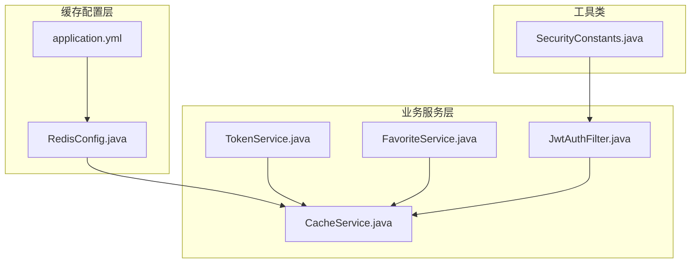

**图表来源**
- [RedisConfig.java](file://backend/src/main/java/com/freetrader/config/RedisConfig.java#L25-L45)
- [CacheService.java](file://backend/src/main/java/com/freetrader/service/CacheService.java#L27-L28)

**章节来源**
- [RedisConfig.java](file://backend/src/main/java/com/freetrader/config/RedisConfig.java#L1-L79)
- [application.yml](file://backend/src/main/resources/application.yml#L24-L45)

## 核心组件

### CacheService 核心功能

CacheService 是整个缓存系统的核心组件，提供了统一的缓存操作接口。其主要职责包括：

1. **基础缓存操作**：set、get、delete、hasKey
2. **Token 黑名单管理**：添加、检查 Token 是否在黑名单中
3. **用户收藏缓存**：缓存用户收藏的板块 ID 列表
4. **批量删除操作**：使用 SCAN 命令替代 KEYS 命令进行安全的批量删除
5. **缓存清理**：清除特定用户或板块相关的缓存

**章节来源**
- [CacheService.java](file://backend/src/main/java/com/freetrader/service/CacheService.java#L18-L82)

## 架构概览

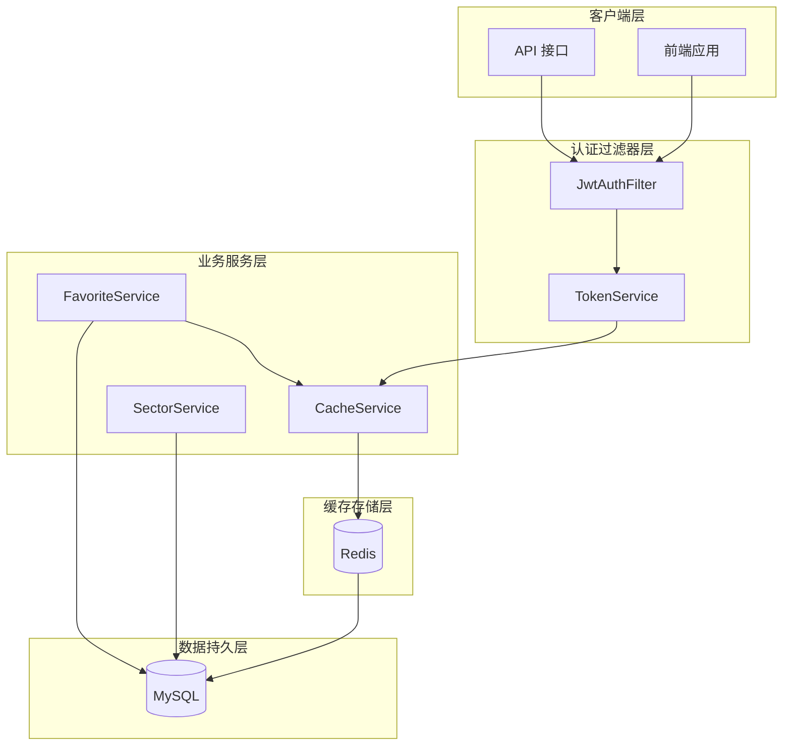

**图表来源**
- [JwtAuthFilter.java](file://backend/src/main/java/com/freetrader/security/JwtAuthFilter.java#L32-L82)
- [TokenService.java](file://backend/src/main/java/com/freetrader/service/TokenService.java#L18-L62)
- [CacheService.java](file://backend/src/main/java/com/freetrader/service/CacheService.java#L84-L204)

## 详细组件分析

### 缓存键命名规范

CacheService 实现了清晰的缓存键命名规范，采用前缀加标识符的方式：

#### 主要前缀定义

| 前缀常量 | 前缀值 | 用途 | 示例 |
|---------|--------|------|------|
| TOKEN_BLACKLIST_PREFIX | "token:blacklist:" | Token 黑名单 | token:blacklist:abc123 |
| USER_CACHE_PREFIX | "user:" | 用户相关缓存 | user:123:profile |
| USER_FAVORITES_PREFIX | "user:favorites:" | 用户收藏缓存 | user:favorites:123 |
| SECTOR_CACHE_PREFIX | "sector:" | 板块相关缓存 | sector:info |

#### 前缀设计原则

1. **层次化组织**：使用冒号分隔不同层级，便于管理和查询
2. **语义明确**：前缀直接反映缓存内容的业务含义
3. **可扩展性**：支持在同一前缀下添加子级标识符
4. **避免冲突**：确保不同业务领域的缓存键不会相互干扰

**章节来源**
- [CacheService.java](file://backend/src/main/java/com/freetrader/service/CacheService.java#L29-L35)

### 基础缓存操作实现

#### SET 操作
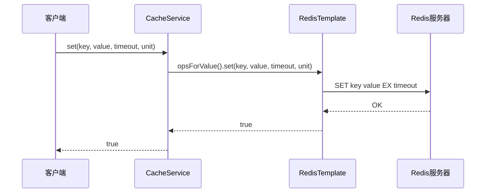

**图表来源**
- [CacheService.java](file://backend/src/main/java/com/freetrader/service/CacheService.java#L40-L46)

#### GET 操作
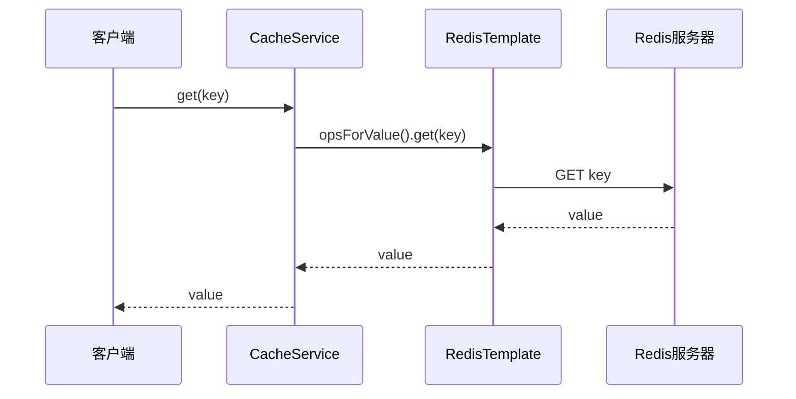

**图表来源**
- [CacheService.java](file://backend/src/main/java/com/freetrader/service/CacheService.java#L51-L58)

#### DELETE 操作
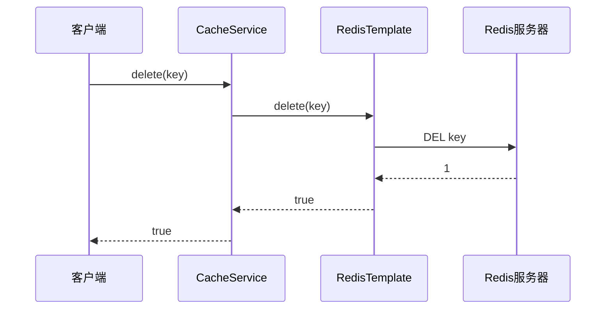

**图表来源**
- [CacheService.java](file://backend/src/main/java/com/freetrader/service/CacheService.java#L63-L70)

#### HASKEY 操作
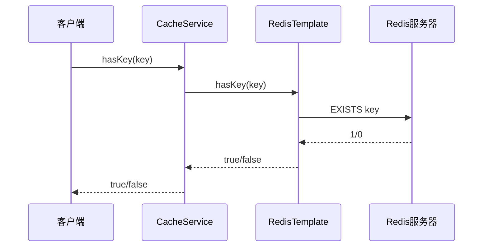

**图表来源**
- [CacheService.java](file://backend/src/main/java/com/freetrader/service/CacheService.java#L75-L82)

**章节来源**
- [CacheService.java](file://backend/src/main/java/com/freetrader/service/CacheService.java#L37-L82)

### Token 黑名单管理

Token 黑名单是实现安全注销和防止已失效 Token 使用的关键机制。

#### 黑名单工作流程

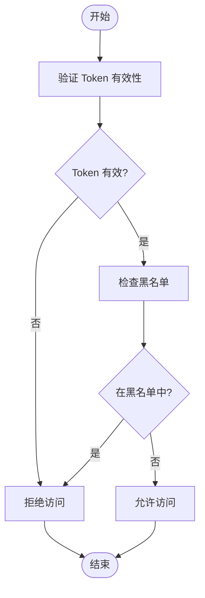

**图表来源**
- [TokenService.java](file://backend/src/main/java/com/freetrader/service/TokenService.java#L29-L32)
- [JwtAuthFilter.java](file://backend/src/main/java/com/freetrader/security/JwtAuthFilter.java#L50-L54)

#### 登出流程

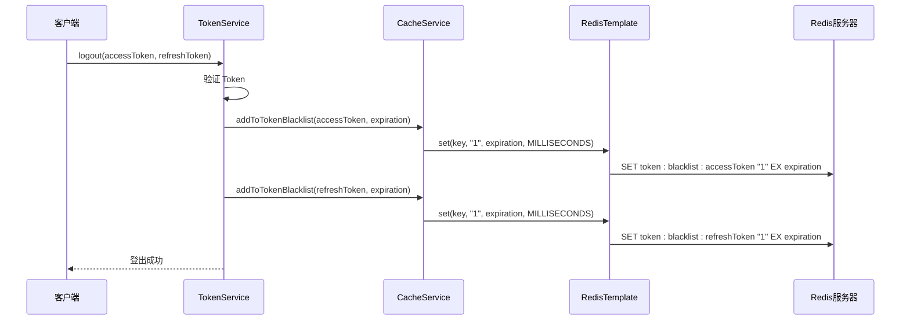

**图表来源**
- [TokenService.java](file://backend/src/main/java/com/freetrader/service/TokenService.java#L41-L55)
- [CacheService.java](file://backend/src/main/java/com/freetrader/service/CacheService.java#L89-L93)

**章节来源**
- [TokenService.java](file://backend/src/main/java/com/freetrader/service/TokenService.java#L18-L62)
- [CacheService.java](file://backend/src/main/java/com/freetrader/service/CacheService.java#L84-L101)

### 用户收藏缓存

用户收藏缓存实现了对用户收藏板块的高效管理，避免频繁查询数据库。

#### 收藏缓存流程

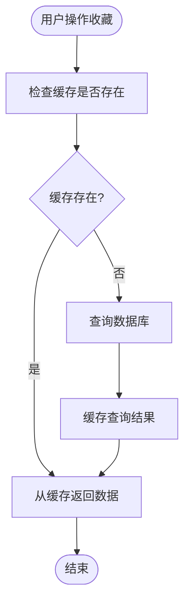

**图表来源**
- [FavoriteService.java](file://backend/src/main/java/com/freetrader/service/FavoriteService.java#L34-L41)
- [CacheService.java](file://backend/src/main/java/com/freetrader/service/CacheService.java#L108-L130)

#### 收藏操作序列

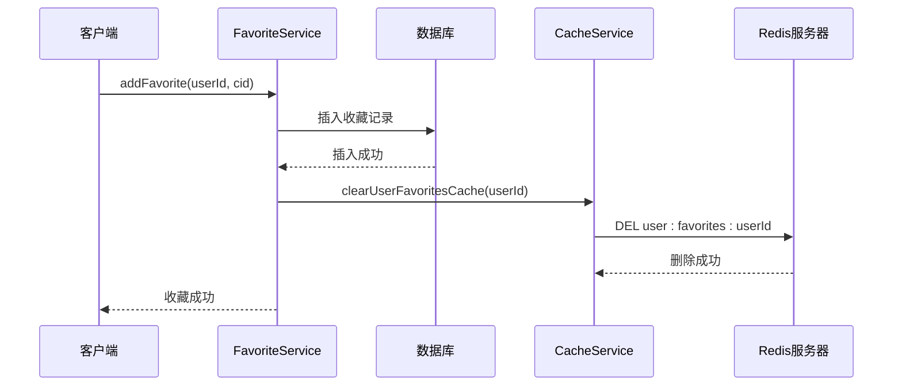

**图表来源**
- [FavoriteService.java](file://backend/src/main/java/com/freetrader/service/FavoriteService.java#L47-L66)
- [CacheService.java](file://backend/src/main/java/com/freetrader/service/CacheService.java#L135-L139)

**章节来源**
- [FavoriteService.java](file://backend/src/main/java/com/freetrader/service/FavoriteService.java#L34-L117)
- [CacheService.java](file://backend/src/main/java/com/freetrader/service/CacheService.java#L103-L139)

### 批量删除操作（SCAN 替代 KEYS）

#### SCAN 命令优势

Redis 提供了 SCAN 命令来替代 KEYS 命令，主要优势包括：

1. **非阻塞性**：SCAN 是渐进式扫描，不会阻塞 Redis 服务器
2. **安全性**：避免了 KEYS 命令可能造成的性能问题
3. **可控性**：可以控制每次迭代返回的键数量

#### SCAN 实现原理

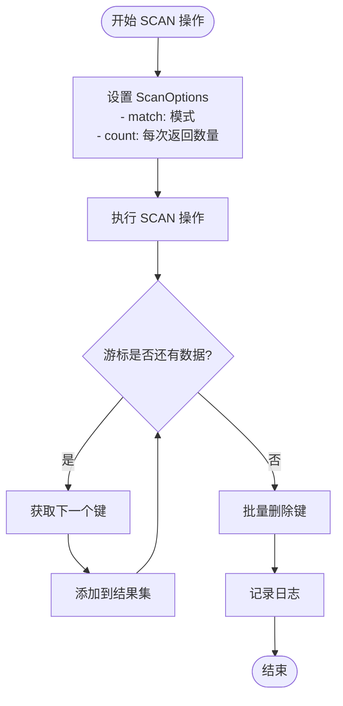

**图表来源**
- [CacheService.java](file://backend/src/main/java/com/freetrader/service/CacheService.java#L147-L183)

#### 扫描配置参数

| 参数 | 默认值 | 说明 |
|------|--------|------|
| SCAN_COUNT | 100 | 每次迭代返回的最大键数量 |
| ScanOptions.match | 模式字符串 | 要匹配的键模式 |
| ScanOptions.count | 100 | 控制扫描速度的批大小 |

**章节来源**
- [CacheService.java](file://backend/src/main/java/com/freetrader/service/CacheService.java#L141-L183)

### 缓存清理策略

#### 板块缓存清理

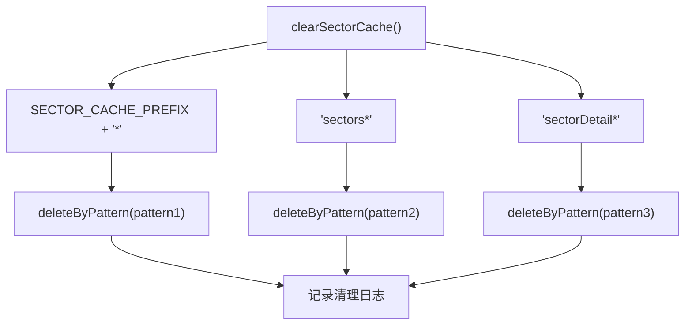

**图表来源**
- [CacheService.java](file://backend/src/main/java/com/freetrader/service/CacheService.java#L190-L195)

#### 用户缓存清理

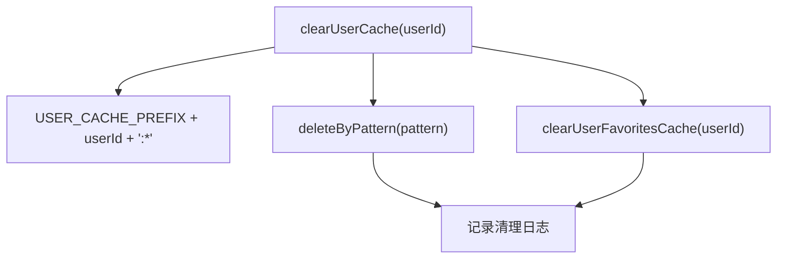

**图表来源**
- [CacheService.java](file://backend/src/main/java/com/freetrader/service/CacheService.java#L200-L204)

**章节来源**
- [CacheService.java](file://backend/src/main/java/com/freetrader/service/CacheService.java#L185-L204)

## 依赖关系分析

### 组件依赖图

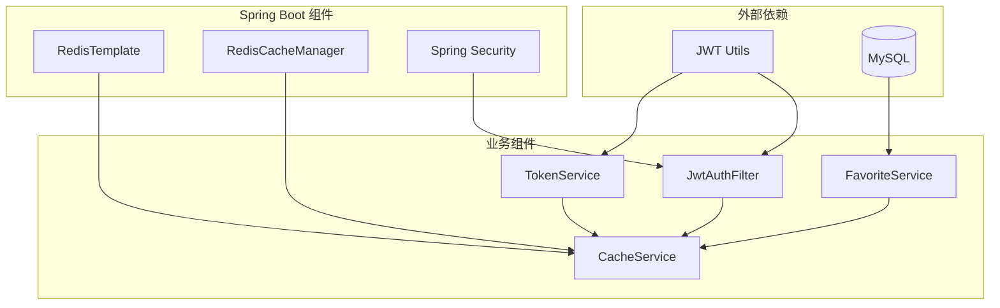

**图表来源**
- [TokenService.java](file://backend/src/main/java/com/freetrader/service/TokenService.java#L15-L16)
- [FavoriteService.java](file://backend/src/main/java/com/freetrader/service/FavoriteService.java#L27-L29)
- [JwtAuthFilter.java](file://backend/src/main/java/com/freetrader/security/JwtAuthFilter.java#L27-L29)

### 缓存配置依赖

#### Redis 序列化配置

| 配置项 | 序列化器 | 说明 |
|--------|----------|------|
| keySerializer | StringRedisSerializer | 键序列化 |
| hashKeySerializer | StringRedisSerializer | Hash 键序列化 |
| valueSerializer | Jackson2JsonRedisSerializer | 值 JSON 序列化 |
| hashValueSerializer | Jackson2JsonRedisSerializer | Hash 值 JSON 序列化 |

#### 缓存 TTL 配置

| 缓存区域 | TTL | 说明 |
|----------|-----|------|
| 默认缓存 | 30 分钟 | 通用缓存默认过期时间 |
| sectors | 5 分钟 | 板块列表缓存 |
| sectorDetail | 5 分钟 | 板块详情缓存 |
| userInfo | 10 分钟 | 用户信息缓存 |

**章节来源**
- [RedisConfig.java](file://backend/src/main/java/com/freetrader/config/RedisConfig.java#L25-L77)
- [application.yml](file://backend/src/main/resources/application.yml#L42-L44)

## 性能考虑

### 缓存过期策略

#### 动态过期时间

CacheService 支持动态设置缓存过期时间，根据不同业务场景设置合适的 TTL：

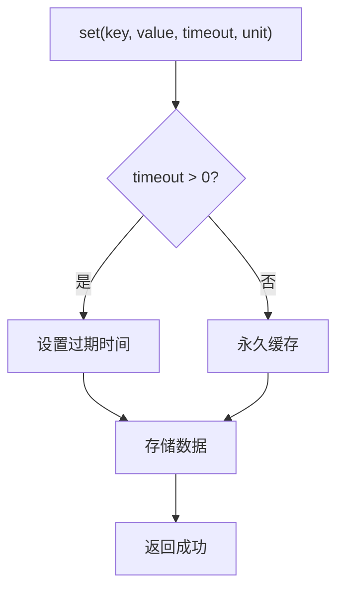

**图表来源**
- [CacheService.java](file://backend/src/main/java/com/freetrader/service/CacheService.java#L40-L46)

#### 缓存 TTL 最佳实践

| 缓存类型 | 推荐 TTL | 原因 |
|----------|----------|------|
| 用户会话 | 1-2 小时 | 平衡安全性与用户体验 |
| 板块数据 | 5-10 分钟 | 实时性要求较高 |
| 用户收藏 | 1-2 小时 | 变化频率较低 |
| Token 黑名单 | 1-7 天 | 防止暴力破解 |

### 缓存穿透防护

#### 查询空值处理

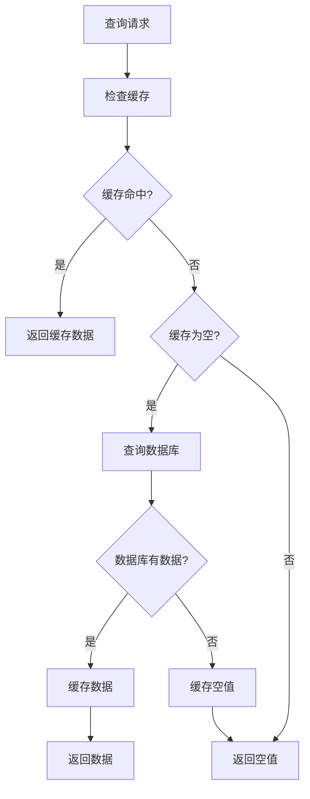

**图表来源**
- [RedisConfig.java](file://backend/src/main/java/com/freetrader/config/RedisConfig.java#L60)

### 缓存雪崩预防

#### 随机化过期时间

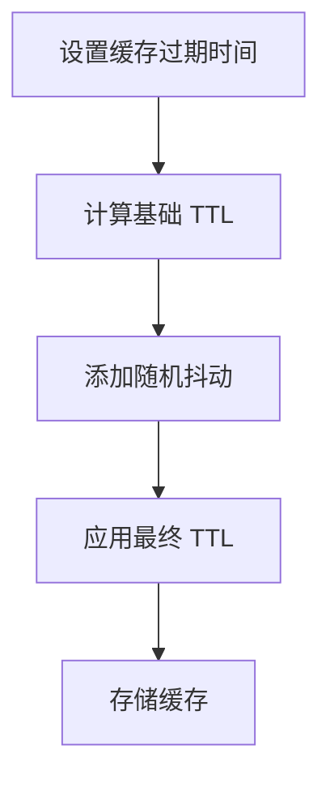

**图表来源**
- [CacheService.java](file://backend/src/main/java/com/freetrader/service/CacheService.java#L89-L93)

### 缓存命中率优化

#### 命中率监控指标

| 指标 | 计算公式 | 优化建议 |
|------|----------|----------|
| 命中率 | hit/(hit+miss) | 增大缓存容量，优化键设计 |
| 命中延迟 | avg_response_time | 减少网络往返，优化序列化 |
| 内存利用率 | used_memory/max_memory | 调整 TTL，定期清理 |

### 缓存数据一致性保证

#### 读写一致性策略

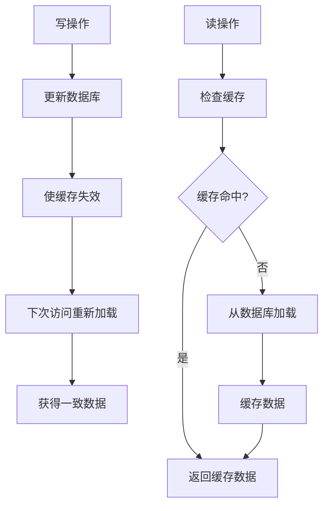

**图表来源**
- [FavoriteService.java](file://backend/src/main/java/com/freetrader/service/FavoriteService.java#L63-L64)

## 故障排除指南

### 常见问题及解决方案

#### 缓存连接问题

**问题症状**：Redis 连接超时，缓存操作失败

**排查步骤**：
1. 检查 Redis 服务器状态
2. 验证连接配置参数
3. 查看网络连通性

**配置参考**：
- 连接超时：10000ms
- 最大活跃连接：8
- 最大空闲连接：8

#### 缓存序列化问题

**问题症状**：缓存数据无法正确序列化或反序列化

**解决方案**：
1. 确保实体类实现序列化接口
2. 检查 Jackson 配置
3. 验证对象类型兼容性

#### 缓存键冲突问题

**问题症状**：不同业务使用相同缓存键导致数据覆盖

**预防措施**：
1. 严格遵守前缀命名规范
2. 使用唯一标识符区分不同用户
3. 定期清理过期缓存键

**章节来源**
- [application.yml](file://backend/src/main/resources/application.yml#L31-L37)
- [RedisConfig.java](file://backend/src/main/java/com/freetrader/config/RedisConfig.java#L30-L42)

### 性能监控指标

#### 关键监控指标

| 指标名称 | 监控意义 | 告警阈值 |
|----------|----------|----------|
| 命中率 | 缓存效率 | < 70% |
| 延迟 | 响应性能 | > 100ms |
| 内存使用率 | 资源占用 | > 80% |
| 连接数 | 并发能力 | > 90% |

#### 日志记录策略

CacheService 中的关键操作都包含了详细的日志记录：

- 缓存操作成功：DEBUG 级别
- 缓存操作失败：ERROR 级别  
- 缓存清理操作：INFO 级别
- 性能警告：WARN 级别

**章节来源**
- [CacheService.java](file://backend/src/main/java/com/freetrader/service/CacheService.java#L44-L45)
- [CacheService.java](file://backend/src/main/java/com/freetrader/service/CacheService.java#L154-L156)

## 结论

FreeTrader 项目的 Redis 缓存策略展现了良好的设计原则和实现质量：

### 设计亮点

1. **清晰的命名规范**：采用前缀加标识符的方式，便于管理和维护
2. **安全的批量操作**：使用 SCAN 命令替代 KEYS，避免阻塞问题
3. **完善的错误处理**：每个操作都有详细的异常处理和日志记录
4. **灵活的过期策略**：支持动态设置过期时间，适应不同业务需求
5. **全面的安全保障**：Token 黑名单机制有效防止已失效 Token 的使用

### 最佳实践建议

1. **监控缓存性能**：建立完善的监控体系，及时发现性能问题
2. **定期清理过期数据**：避免缓存空间浪费
3. **优化键设计**：遵循命名规范，避免键冲突
4. **合理设置 TTL**：根据业务特点调整过期时间
5. **备份重要缓存**：对关键数据建立备份机制

该缓存策略为 FreeTrader 项目提供了稳定高效的缓存支持，为系统的高性能运行奠定了坚实基础。