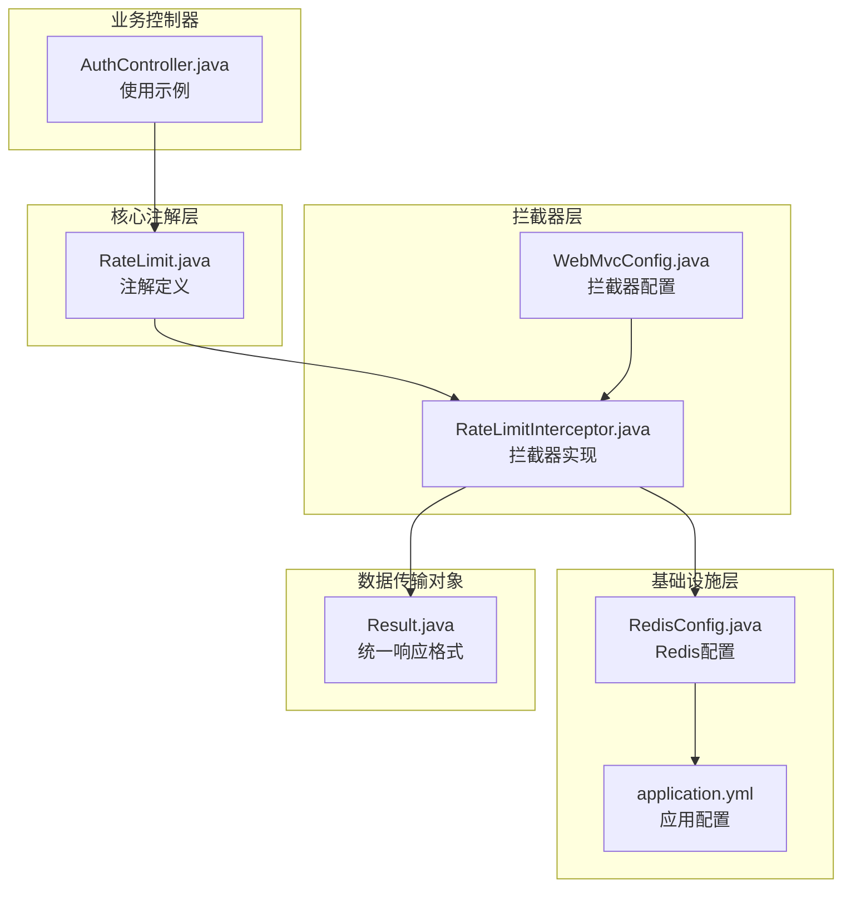
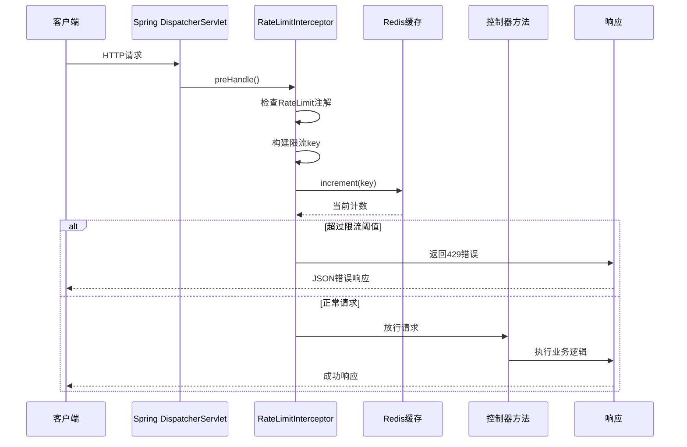
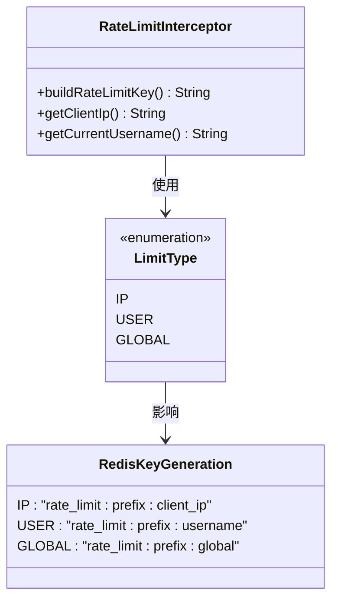
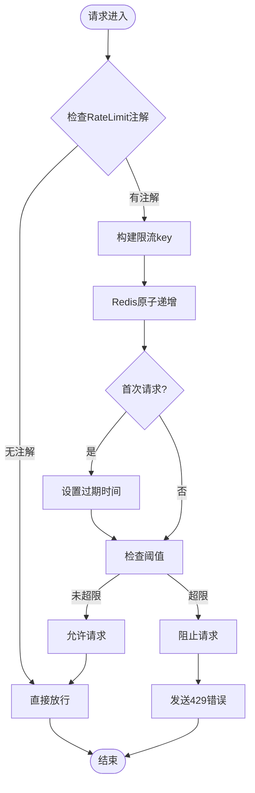
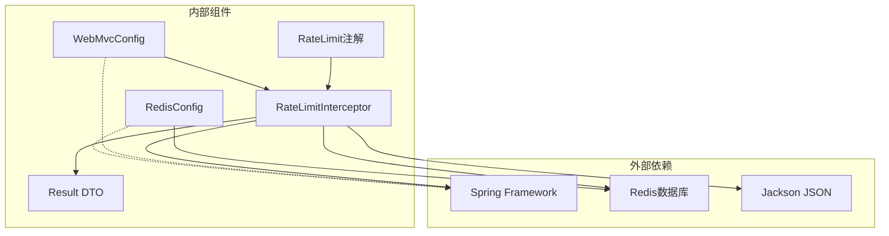

# 速率限制系统

<cite>
**本文档引用的文件**
- [RateLimit.java](file://backend/src/main/java/com/freetrader/annotation/RateLimit.java)
- [RateLimitInterceptor.java](file://backend/src/main/java/com/freetrader/interceptor/RateLimitInterceptor.java)
- [RedisConfig.java](file://backend/src/main/java/com/freetrader/config/RedisConfig.java)
- [WebMvcConfig.java](file://backend/src/main/java/com/freetrader/config/WebMvcConfig.java)
- [application.yml](file://backend/src/main/resources/application.yml)
- [Result.java](file://backend/src/main/java/com/freetrader/dto/Result.java)
- [AuthController.java](file://backend/src/main/java/com/freetrader/controller/AuthController.java)
</cite>

## 目录
1. [简介](#简介)
2. [项目结构](#项目结构)
3. [核心组件](#核心组件)
4. [架构概览](#架构概览)
5. [详细组件分析](#详细组件分析)
6. [依赖关系分析](#依赖关系分析)
7. [性能考虑](#性能考虑)
8. [故障排除指南](#故障排除指南)
9. [结论](#结论)

## 简介

FreeTrader 项目的速率限制系统是一个基于 Spring MVC 拦截器和 Redis 的分布式限流解决方案。该系统通过注解驱动的方式，为应用程序提供了灵活且可配置的请求频率控制能力。系统采用滑动窗口计数器算法，结合 Redis 实现全局状态共享，确保在多实例部署环境下的一致性限流效果。

## 项目结构

速率限制系统主要分布在以下目录结构中：

**图表来源**
- [RateLimit.java](file://backend/src/main/java/com/freetrader/annotation/RateLimit.java#L1-L49)
- [RateLimitInterceptor.java](file://backend/src/main/java/com/freetrader/interceptor/RateLimitInterceptor.java#L1-L153)
- [RedisConfig.java](file://backend/src/main/java/com/freetrader/config/RedisConfig.java#L1-L79)
- [WebMvcConfig.java](file://backend/src/main/java/com/freetrader/config/WebMvcConfig.java#L1-L26)

**章节来源**
- [RateLimit.java](file://backend/src/main/java/com/freetrader/annotation/RateLimit.java#L1-L49)
- [RateLimitInterceptor.java](file://backend/src/main/java/com/freetrader/interceptor/RateLimitInterceptor.java#L1-L153)
- [RedisConfig.java](file://backend/src/main/java/com/freetrader/config/RedisConfig.java#L1-L79)
- [WebMvcConfig.java](file://backend/src/main/java/com/freetrader/config/WebMvcConfig.java#L1-L26)

## 核心组件

### RateLimit 注解

RateLimit 注解是整个限流系统的核心配置入口，提供了四个关键参数：

- **window**: 限流时间窗口（秒），默认 60 秒
- **maxRequests**: 时间窗口内的最大请求数，默认 10 次  
- **prefix**: 限流 key 前缀，用于区分不同接口的限流规则
- **limitType**: 限流类型枚举，支持 IP、USER、GLOBAL 三种模式

**章节来源**
- [RateLimit.java](file://backend/src/main/java/com/freetrader/annotation/RateLimit.java#L14-L38)

### RateLimitInterceptor 拦截器

拦截器实现了 HandlerInterceptor 接口，负责在请求到达控制器之前进行限流检查。其核心功能包括：

- 请求预处理：检查方法是否带有 RateLimit 注解
- 动态限流键构建：根据限流类型生成唯一的 Redis key
- 滑动窗口计数器算法：基于 Redis 实现精确的请求频率控制
- 错误响应处理：当超过限流阈值时返回标准的 JSON 响应

**章节来源**
- [RateLimitInterceptor.java](file://backend/src/main/java/com/freetrader/interceptor/RateLimitInterceptor.java#L35-L62)

## 架构概览

**图表来源**
- [RateLimitInterceptor.java](file://backend/src/main/java/com/freetrader/interceptor/RateLimitInterceptor.java#L35-L62)
- [AuthController.java](file://backend/src/main/java/com/freetrader/controller/AuthController.java#L34-L51)

## 详细组件分析

### 注解参数详解

#### window 参数
- **含义**: 限流统计的时间窗口长度（秒）
- **默认值**: 60 秒
- **配置建议**: 
  - 登录接口：30-60 秒，防止暴力破解
  - 注册接口：60-120 秒，平衡用户体验与安全
  - 普通查询接口：60-300 秒，避免爬虫攻击

#### maxRequests 参数  
- **含义**: 在时间窗口内允许的最大请求数
- **默认值**: 10 次
- **配置建议**:
  - 登录接口：3-5 次，严格限制暴力破解
  - 注册接口：1-3 次，防止批量注册
  - API 查询接口：50-200 次，满足正常业务需求

#### prefix 参数
- **含义**: Redis key 的前缀标识
- **作用**: 区分不同接口的限流规则，避免相互干扰
- **使用示例**: "login"、"register"、"api-query"

#### limitType 参数
限流类型决定了限流作用域的不同维度：

**图表来源**
- [RateLimit.java](file://backend/src/main/java/com/freetrader/annotation/RateLimit.java#L40-L47)
- [RateLimitInterceptor.java](file://backend/src/main/java/com/freetrader/interceptor/RateLimitInterceptor.java#L67-L91)

**章节来源**
- [RateLimit.java](file://backend/src/main/java/com/freetrader/annotation/RateLimit.java#L14-L47)
- [RateLimitInterceptor.java](file://backend/src/main/java/com/freetrader/interceptor/RateLimitInterceptor.java#L67-L91)

### 拦截器实现原理

#### 请求统计机制

拦截器采用滑动窗口计数器算法，通过 Redis 的原子操作实现精确的请求统计：

**图表来源**
- [RateLimitInterceptor.java](file://backend/src/main/java/com/freetrader/interceptor/RateLimitInterceptor.java#L96-L114)

#### 错误响应机制

当请求超过限流阈值时，拦截器会返回标准的 JSON 错误响应：

- **HTTP状态码**: 429 Too Many Requests
- **响应格式**: 使用 Result 统一包装
- **错误信息**: "请求过于频繁，请稍后再试"

**章节来源**
- [RateLimitInterceptor.java](file://backend/src/main/java/com/freetrader/interceptor/RateLimitInterceptor.java#L48-L62)
- [Result.java](file://backend/src/main/java/com/freetrader/dto/Result.java#L23-L29)

### 不同限流类型的实现

#### IP 限流
- **适用场景**: 防止同一客户端的恶意请求
- **实现方式**: 基于客户端真实 IP 地址生成 key
- **代理支持**: 自动处理 X-Forwarded-For、Proxy-Client-IP 等头部

#### 用户限流  
- **适用场景**: 基于已登录用户的限流控制
- **实现方式**: 基于当前用户名生成 key
- **安全考虑**: 未登录用户使用匿名标识

#### 全局限流
- **适用场景**: 对整个系统或特定功能的全局限制
- **实现方式**: 使用固定标识 "global" 作为 key 后缀

**章节来源**
- [RateLimitInterceptor.java](file://backend/src/main/java/com/freetrader/interceptor/RateLimitInterceptor.java#L78-L88)
- [RateLimitInterceptor.java](file://backend/src/main/java/com/freetrader/interceptor/RateLimitInterceptor.java#L119-L151)

## 依赖关系分析

**图表来源**
- [RateLimitInterceptor.java](file://backend/src/main/java/com/freetrader/interceptor/RateLimitInterceptor.java#L1-L18)
- [WebMvcConfig.java](file://backend/src/main/java/com/freetrader/config/WebMvcConfig.java#L1-L26)
- [RedisConfig.java](file://backend/src/main/java/com/freetrader/config/RedisConfig.java#L1-L45)

### Redis 配置分析

系统使用自定义的 Redis 序列化配置，确保数据存储的兼容性和性能：

- **Key 序列化**: StringRedisSerializer
- **Value 序列化**: Jackson2JsonRedisSerializer
- **连接池**: Lettuce 连接池配置
- **缓存管理**: RedisCacheManager 配置

**章节来源**
- [RedisConfig.java](file://backend/src/main/java/com/freetrader/config/RedisConfig.java#L25-L45)
- [application.yml](file://backend/src/main/resources/application.yml#L24-L38)

### Web 配置集成

拦截器通过 WebMvcConfig 注册到 Spring MVC 中：

- **路径匹配**: /api/** 所有 API 接口
- **排除规则**: /api/auth/refresh 接口不参与限流
- **拦截时机**: 请求预处理阶段执行

**章节来源**
- [WebMvcConfig.java](file://backend/src/main/java/com/freetrader/config/WebMvcConfig.java#L19-L24)

## 性能考虑

### 算法选择与实现

系统采用滑动窗口计数器算法，具有以下特点：

- **准确性**: 基于 Redis 原子操作，避免竞态条件
- **性能**: 单次 Redis 操作完成计数和过期设置
- **内存**: 每个限流键占用少量内存空间
- **扩展性**: 支持水平扩展，多实例共享状态

### Redis 性能优化

- **连接池**: 配置合理的最大连接数和空闲连接数
- **序列化**: 使用高效的 JSON 序列化方案
- **TTL 管理**: 自动过期机制减少内存占用
- **网络延迟**: 本地部署 Redis 减少网络开销

### 监控指标建议

建议收集以下关键指标进行性能监控：

- **QPS**: 每秒请求数量
- **限流命中率**: 超过阈值的请求比例
- **Redis 延迟**: Redis 操作平均耗时
- **错误率**: 429 错误响应比例
- **系统负载**: CPU、内存使用情况

## 故障排除指南

### 常见问题诊断

#### 限流不生效
- **检查注解配置**: 确认目标方法正确添加了 RateLimit 注解
- **验证拦截器注册**: 检查 WebMvcConfig 是否正确注册拦截器
- **Redis 连接**: 确认 Redis 服务正常运行

#### IP 识别错误
- **代理配置**: 检查反向代理是否正确传递客户端 IP
- **头部验证**: 确认 X-Forwarded-For 等头部是否被正确设置

#### 用户限流异常
- **认证状态**: 确认用户已正确登录并建立认证上下文
- **用户名获取**: 检查 SecurityContextHolder 中的认证信息

### 错误处理机制

系统实现了完善的错误处理策略：

- **Redis 异常**: 发生异常时自动放行请求，保证系统稳定性
- **日志记录**: 详细记录限流触发和错误信息
- **优雅降级**: 在极端情况下提供基本的限流保护

**章节来源**
- [RateLimitInterceptor.java](file://backend/src/main/java/com/freetrader/interceptor/RateLimitInterceptor.java#L109-L113)

## 结论

FreeTrader 项目的速率限制系统通过注解驱动的方式，为应用程序提供了灵活且高效的请求频率控制能力。系统采用滑动窗口计数器算法，结合 Redis 实现全局状态共享，确保在分布式环境下的准确限流效果。

### 主要优势

1. **配置简单**: 通过注解即可实现复杂的限流规则
2. **类型丰富**: 支持 IP、用户、全局三种限流类型
3. **性能优异**: 基于 Redis 原子操作，低延迟高并发
4. **扩展性强**: 易于添加新的限流类型和算法
5. **监控友好**: 提供详细的日志和错误处理机制

### 最佳实践建议

1. **合理配置参数**: 根据业务场景调整 window 和 maxRequests 参数
2. **分层限流**: 对不同接口采用不同的限流策略
3. **监控告警**: 建立完善的监控体系，及时发现异常流量
4. **定期评估**: 根据实际使用情况调整限流参数
5. **灰度发布**: 新增限流规则时采用渐进式部署

该系统为 FreeTrader 项目提供了坚实的安全基础，有效防止了恶意请求和滥用行为，同时保持了良好的用户体验和系统性能。